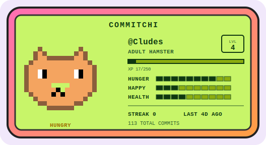

# Commitchi

A Tamagotchi-style digital pet that lives or dies based on your GitHub commit activity.
Feed it commits. Keep it alive. Don't let it die.

**Live demo:** https://cludes.github.io/commitchi/?u=Cludes

<!-- TODO: add a screenshot or GIF of the pet card here -->


---

## Features

- Pixel-art pet on a Game Boy-style LCD inside a Tamagotchi device frame
- Mood, hunger, health, level, XP, and streak derived from your public commit activity
- **Evolutions**: egg, then a smaller baby, adult, a veteran with shades, and an elder with a crown + aura, as your level climbs
- **Achievements**: earn badges for streaks, commit counts, polyglot, and max level
- 12-week contribution heatmap (weekday-aligned) and a recent-commits feed
- Seven species mapped from your top language, with a per-user species override
- Light / dark theme (follows your OS by default), editable pet name, level-up toast
- **Idle animations**: gentle float/sway, egg wobble, feed hearts, ecstatic sparkles
- Compare mode: two pets side by side, crown to the happier one
- **Download** your pet card as a PNG, or share a direct link
- Dormant state for inactive accounts, rate-limit countdown, manual refresh, recent searches
- Accessible: reduced-motion support, focus rings, aria labels
- Auto-generated light + dark SVG cards for embedding in your GitHub profile README

---

## How it works

Your pet's survival is tied to your commit history:

| Situation | Pet state |
|---|---|
| Committed today + long streak | Ecstatic |
| Committed in the last 2 days | Happy |
| 3 days since last commit | Content |
| 4-6 days | Hungry |
| 7-10 days | Sad |
| 11-20 days | Critical |
| 21+ days without a commit | Dead |

Your pet's **species** is determined by your most-used language:

| Language | Pet |
|---|---|
| JavaScript / TypeScript | Hamster |
| Python | Snake |
| Lua | Moon Cat |
| Rust | Crab |
| Go | Gopher |
| Ruby | Gem |
| Everything else | Blob |

Your pet's **level**, **XP bar**, and **evolution stage** grow with your total commit
activity. A 12-week contribution heatmap and recent commit feed show on the device screen.

---

## Use it now

No setup needed. Just visit:

```
https://cludes.github.io/commitchi/?u=YOUR_GITHUB_USERNAME
```

Tap the SHARE YOUR PET button to copy a direct link to your creature.

---

## Zero-setup card (hosted)

The fastest way to embed your pet anywhere - no fork, no setup. Once deployed, anyone
embeds their own card with one line:

```markdown

```

Query params: `u` (required), `theme=dark`, `species=mooncat`. Cards are edge-cached for
30 minutes. The same card builder powers the app, the profile SVG, and this endpoint.

### Deploy to Cloudflare Pages

1. Go to [dash.cloudflare.com](https://dash.cloudflare.com) - Workers & Pages - Create -
   Pages - Connect to Git, and pick this repo.
2. Build settings:
   - **Framework preset:** Vite
   - **Build command:** `npm run build`
   - **Build output directory:** `dist`
3. (Optional) Settings - Environment variables: add `GITHUB_TOKEN` (a GitHub PAT, no scopes
   needed) to raise the API rate limit from 60/hr to 5000/hr.
4. Deploy. The function in [`functions/api/card.js`](functions/api/card.js) is auto-routed
   to `/api/card`, so your card is at `https://<project>.pages.dev/api/card?u=USERNAME`.

> Also works on Vercel via [`api/card.mjs`](api/card.mjs) - import the repo at
> [vercel.com](https://vercel.com) (it auto-detects Vite + the `api/` function); the URL
> is then `https://<project>.vercel.app/api/card?u=USERNAME`.

---

## Put your pet on your GitHub profile (no hosting)

Prefer not to host anything? Your profile README can't run JavaScript, but it can show
an image. This repo ships a GitHub Action that regenerates an SVG of your pet once a day
and commits it as `commitchi.svg`, so you can embed a live, self-updating pet on your profile.

**1. Fork this repo** (see below) so the Action runs under your account.

**2. Let the Action run.** It runs daily at 06:00 UTC, and you can trigger it
manually from the Actions tab (Update Pet SVG - Run workflow). It uses your account
(`github.repository_owner`) automatically, so no config is needed. It produces
`commitchi.svg` in the repo root.

**3. Add the image to your profile README.** Create a repo named exactly your
username (e.g. `Cludes/Cludes`), and put this in its `README.md`. The `<picture>`
element shows a dark-themed card to viewers using GitHub dark mode:

```html
<picture>
  <source media="(prefers-color-scheme: dark)" srcset="https://raw.githubusercontent.com/YOUR_USERNAME/commitchi/master/commitchi-dark.svg">
  
</picture>
```

The pet's mood, level, streak, and stats update every day as you commit.

### Auto-embed in your profile (optional)

You can have the Action insert that image line into your profile README for you,
so you never touch it manually. Because the Action's built-in token can only write
to this repo, you give it write access to your profile repo via a GitHub App:

1. Create a [GitHub App](https://github.com/settings/apps/new) (owned by your
   account). Give it **Repository permissions - Contents: Read and write**. No
   webhook needed.
2. Generate a private key for the app (downloads a `.pem` file), and note the
   numeric **App ID**.
3. Install the app on your account, granting it access to your
   `<username>/<username>` profile repo.
4. In this repo: Settings - Secrets and variables - Actions, and add two secrets:
   - `CLUDESAPP_ID` - the App ID
   - `CLUDESAPP_PEM` - the full contents of the `.pem` private key file
5. Create your `<username>/<username>` repo if you haven't.

On the next run, the `profile` job mints a short-lived installation token from the
app, clones your profile repo, and inserts the embed between
`<!-- COMMITCHI:START -->` / `<!-- COMMITCHI:END -->` markers. It is idempotent -
it only commits when the block is missing or changed. Without the `CLUDESAPP_ID`
secret, the job is skipped.

To regenerate the pet SVG locally:

```bash
COMMITCHI_USER=YOUR_USERNAME node scripts/generate-pet-svg.mjs
```

---

## Self-host your own instance

Fork this repo and deploy your own copy in two steps:

**1. Fork this repo**

Click the Fork button at the top right of this page.

**2. Enable GitHub Pages**

In your forked repo: Settings - Pages - Source - select **GitHub Actions** - Save.

That's it. Every push to `main` or `master` will auto-deploy. Your instance will be live at:

```
https://YOUR_USERNAME.github.io/commitchi/
```

The base path is detected automatically from the repo name - no config needed.

---

## Run locally

```bash
git clone https://github.com/Cludes/commitchi.git
cd commitchi
npm install
npm run dev
```

Then open `http://localhost:5173` and enter any GitHub username.

### Scripts

| Command | What it does |
|---|---|
| `npm run dev` | Start the Vite dev server |
| `npm run build` | Production build to `dist/` |
| `npm run lint` | ESLint over the project |
| `npm run test` | Run the Vitest unit tests once |
| `npm run test:watch` | Run Vitest in watch mode |

Unit tests cover the pure logic in `src/utils/petCalculations.js` (species, level, XP,
mood, streak, daily commits, evolution stage). CI (`.github/workflows/ci.yml`) runs lint,
tests, and build on every push and pull request.

You can pin a species regardless of language with `?species=mooncat` (or the "swap" button
on the card); the choice is remembered per username. You can also preview any evolution
stage with `?stage=elder` / `?level=7` or the on-card PREVIEW chips (preview is visual only -
it does not change your real card).

---

## Roadmap

- **Leaderboard / hall of fame** - a public board of the liveliest pets (longest streaks,
  highest levels, rarest species). This needs a small backend with a datastore (e.g. Vercel
  KV / Upstash) and write-side abuse protection, so it is planned as a follow-up rather than
  part of the static app.

---

## Notes

- Uses the public GitHub API - no authentication or API keys required
- The API allows 60 requests per hour per IP address unauthenticated
- Results are cached in your browser for 5 minutes to ease rate limits
- Only public commit activity is visible
- Activity data covers the last ~90 days of public events
